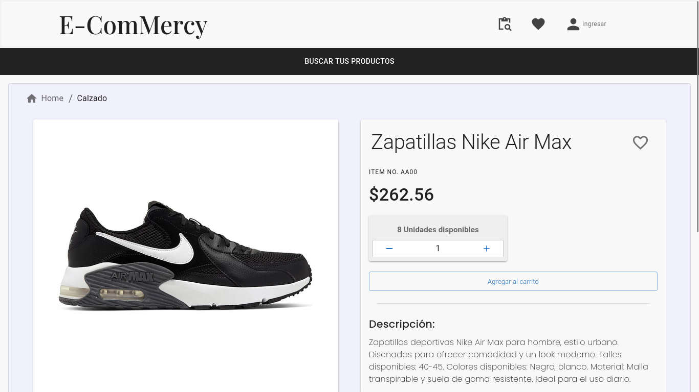
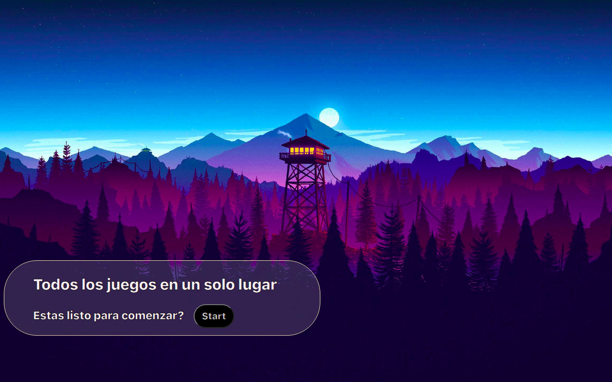

## 
Hey 👋, I'm Allan! Full Stack Developer

 

### Glad to see you here!

My pillars are communication, organization, and a high level of autonomy fueled by my curiosity and passion for technology. I thrive on facing challenges and am actively seeking to join robust teams that share values and commitment.

I specialize in building web applications, with a strong focus on Backend. My experience as a JavaScript programming instructor has provided me a deep understanding of best practices in developing scalable and optimized code. It has also allowed me to build a solid foundation in leading Full Stack technologies.

## Rapidfire

<table align=center><tr><td valign="top" width="50%">

- 🔭 Working as a Javascript programming tutor

- 🌱 Currently learning Java and AWS

- 📍From Tierra del Fuego, Argentina

- ⚡ Fun fact: My favorite animal is the bear (if it's not obvious)

</td><td valign="center" width="50%" align=center>

</td></tr></table>

 

## Languages and Tools

  
  
  
  
  
  
  
  
  
  
  
  
  
  
  
  
  
  
  
  
  

### Soon...

  
  
  
  
  
  

 

## Proyects

 

## Github Stats

 

#### Buy me a Coffe!

##### Con MercadoPago

---
